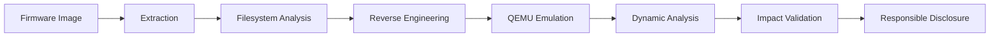
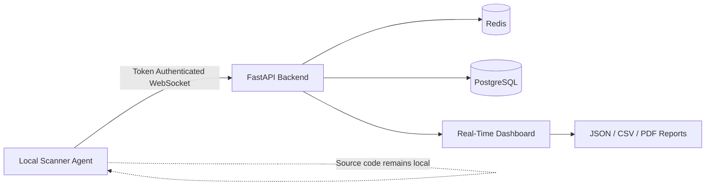
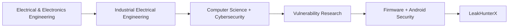

<!-- =========================================================
     OMKAR443 — GITHUB PROFILE README
     Security Researcher • Firmware RE • Android • Web • IoT
========================================================== -->

<div align="center">


### `FIRMWARE RE` • `ANDROID SECURITY` • `WEB SECURITY` • `IoT`

<br>


<br>

> **Reverse engineering systems. Breaking assumptions. Building security tooling.**

<br>

<a href="https://leakhunterx.com">
  
</a>
<a href="https://hackerone.com/omkar_sahni">
  
</a>
<a href="https://www.linkedin.com/in/omkar-sahni-89b952324">
  
</a>

</div>

---

## `$ whoami`

```bash
omkar@research:~$ whoami

Security Researcher
Vulnerability Researcher
Firmware Reverse Engineer
Security Tool Builder
Founder @ LeakHunterX
```

I am an independent security researcher focused on **firmware reverse engineering, Android security, vulnerability research, IoT security, and offensive security engineering**.

My work spans the full vulnerability research lifecycle:

```text
RECON → STATIC ANALYSIS → REVERSE ENGINEERING → EMULATION
           ↓
DISCLOSURE ← VALIDATION ← EXPLOIT RESEARCH ← DYNAMIC ANALYSIS
```

I also build security infrastructure and automation, including **LeakHunterX**, a distributed secret-scanning platform designed to analyze source code while keeping customer source files local.

<br>

```text
[+] Firmware Reverse Engineering     ARM / MIPS
[+] Android Application Security     IPC / Intents / Accessibility
[+] Web & API Security               Offensive Research
[+] IoT / Embedded Security          Hardware + Firmware
[+] Security Automation              Python / Backend Systems
[+] Vulnerability Research           PoC → Disclosure → Verification
```

---

# 🛡️ Selected Security Research

<table>
<tr>
<td width="33%" valign="top">

### 📡 TP-Link Archer C7 v5

**2 CVE submissions pending with MITRE**

`Firmware RE` `ARM` `QEMU` `Binwalk`

Full firmware research chain covering extraction, reverse engineering, emulation and dynamic analysis.

**Research findings**

**CWE-78**  
Command injection in a LuCI web-interface handler with root-level code-execution impact.

**CWE-321**  
Hardcoded RSA private-key material recovered from distributed firmware.

**Firmware**

`v1.2.1 Build 20220715`

**Disclosure**

Vendor confirmed the affected product as End-of-Life.

</td>

<td width="33%" valign="top">

### 🏆 TikTok

**$4,500 Responsible Disclosure Bounty**

Identified and demonstrated a high-impact security vulnerability.

Research involved:

- Vulnerability discovery
- Impact validation
- Sanitized proof of concept
- Technical reporting
- Coordinated triage
- Remediation verification

```text
DISCOVER
   ↓
VALIDATE
   ↓
REPORT
   ↓
TRIAGE
   ↓
REMEDIATE
```

</td>

<td width="33%" valign="top">

### 📱 Coinbase Wallet

**Android Security Research**

Research into sensitive data exposure across Android accessibility boundaries.

Focus areas:

- BIP-39 seed phrase exposure
- `AccessibilityService`
- Controlled PoC APK
- Multi-device validation
- Exfiltration testing
- Mitigation analysis

Evaluated behavior around:

`importantForAccessibility="no-hide-descendants"`

</td>
</tr>
</table>

---

## 🔬 Firmware Research Methodology



```text
Tools commonly involved:

Binwalk
   ↓
Filesystem / Lua / LuCI
   ↓
ARM / MIPS Analysis
   ↓
QEMU
   ↓
Dynamic Testing
   ↓
Exploit Validation
```

---

# ⚡ Currently Building

<div align="center">

## `LeakHunterX`

### Distributed Secret-Scanning Infrastructure

**Founder @ TantraLogic AI**

<a href="https://leakhunterx.com">

</a>

</div>

LeakHunterX is a distributed secret-scanning platform designed to detect exposed credentials while keeping the user's source code on their own machine.

### Architecture



### Highlights

```text
┌─────────────────────────────────────────────────────────────┐
│                                                             │
│  🔐 Source code remains on the user's machine              │
│                                                             │
│  🔎 50+ secret detection patterns                          │
│                                                             │
│  ⚡ Real-time distributed scanning                         │
│                                                             │
│  🧠 Credential & secret classification                     │
│                                                             │
│  📊 JSON / CSV / PDF reporting                            │
│                                                             │
│  🐳 Containerized backend architecture                    │
│                                                             │
└─────────────────────────────────────────────────────────────┘
```

Detection includes patterns associated with:

`AWS` • `GitHub` • `Stripe` • `JWT` • `Database URIs` • `API Keys` • `Credentials`

---

# 🚀 Featured Security Projects

<table>
<tr>

<td width="50%" valign="top">

## 🧠 NYX

**AI Security Research Platform**

Open-source security research platform combining:

- AI security agents
- Attack-surface intelligence
- Dynamic analysis
- Vulnerability discovery
- Validation workflows
- Security knowledge automation

**Primary language:** `Python`

<a href="https://github.com/Omkar443/nyx">

</a>

</td>

<td width="50%" valign="top">

## 🛰️ ProbeRaptor

**Reconnaissance Framework**

Original Python reconnaissance suite designed for bug-bounty attack-surface discovery.

Capabilities include:

- Subdomain brute forcing
- Certificate Transparency analysis
- Parallel port scanning
- Target scoring
- JSON reporting

Built without chaining third-party reconnaissance tools.

<a href="https://github.com/Omkar443/ProbeRaptor">

</a>

</td>
</tr>

<tr>

<td width="50%" valign="top">

## 🤖 LeakHunterX Agent

**Autonomous Security Research Agent**

Security research agent focused on:

- Reconnaissance
- Attack-surface analysis
- Vulnerability discovery
- Research automation

**Primary language:** `Python`

<a href="https://github.com/Omkar443/leakhunterx-agent">

</a>

</td>

<td width="50%" valign="top">

## ⚔️ Kioptrix Level 1

**Exploitation Research / Write-up**

Technical walkthrough covering:

- Reconnaissance
- Service enumeration
- Exploitation
- Linux privilege escalation
- Root access

<a href="https://github.com/Omkar443/Kioptrix-Level1-Writeup">

</a>

</td>

</tr>
</table>

---

# ⚔️ Research Arsenal

### Security Research

<p>


</p>

### Security Tooling

<p>


</p>

### Languages

<p>


</p>

### Backend & Infrastructure

<p>


</p>

---

# ⚡ Hardware → Security

My route into cybersecurity started with **Electrical & Electronics Engineering**.

That background gave me a foundation in:

```text
Circuit Design
     │
     ▼
Digital Logic
     │
     ▼
Microprocessor Architecture
     │
     ▼
Assembly Language
     │
     ▼
Embedded Systems
     │
     ▼
Firmware Reverse Engineering
     │
     ▼
IoT Security
```

This hardware perspective directly influences the way I approach embedded and firmware security research.

---

# 🧭 Journey



### `2018 → 2023`

**Diploma — Electrical & Electronics Engineering**

Korea Nepal Polytechnic Institute

`Microprocessors` • `Assembly` • `Circuit Design` • `Digital Logic`

### `2023 → 2024`

**Sub Electrical Engineer**

Varun Beverages — PepsiCo Franchise

Worked with industrial electrical systems, maintenance and hardware fault diagnosis.

### `2024 → Present`

**B.Tech — Computer Science Engineering (Cyber Security)**

Parul University

### `2025 → Present`

**Independent Security Research**

`Firmware` • `Android` • `Web` • `IoT`

### `2025 → Present`

**Founder — LeakHunterX / TantraLogic AI**

Building security infrastructure and automated vulnerability-research tooling.

---

# 📊 GitHub Activity

<div align="center">


</div>

---

# 🔭 Current Focus

```text
[ RESEARCH ]

Firmware Security
Android Application Security
IoT / Embedded Security
Vulnerability Research


[ BUILDING ]

LeakHunterX
Security Research Automation
Open-Source Security Tooling


[ INTERESTED IN ]

Firmware / Embedded Security
Android Security
Security Engineering
Vulnerability Research
Research Collaboration
```

---

# 📡 Connect

<div align="center">

<a href="https://leakhunterx.com">

</a>

<a href="https://hackerone.com/omkar_sahni">

</a>

<a href="https://www.linkedin.com/in/omkar-sahni-89b952324">

</a>

<a href="https://github.com/Omkar443">

</a>

</div>

<br>

<div align="center">

```text
omkar@research:~$ ./find-next-bug

[+] loading research environment...
[+] initializing toolchain...
[+] attack surface identified...
[+] curiosity enabled...

research never stops.

█
```

<br>

### `BREAK ASSUMPTIONS // BUILD BETTER SYSTEMS`


</div>
