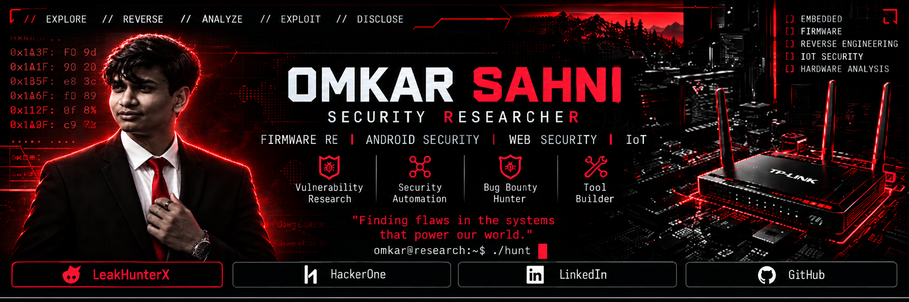
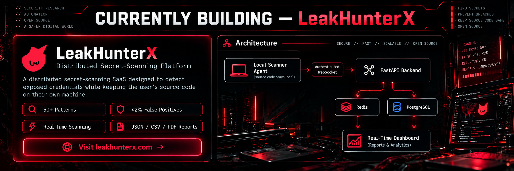
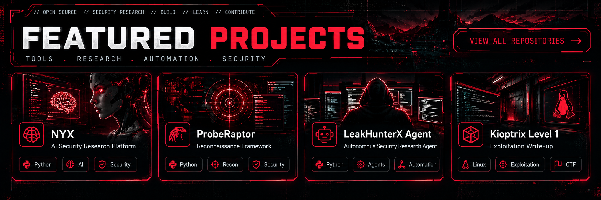
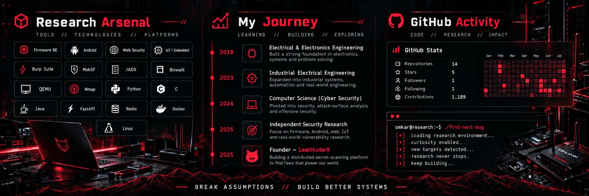

<div align="center">



<br>

[](https://leakhunterx.com)
[](https://hackerone.com/omkar_sahni)
[](https://www.linkedin.com/in/omkar-sahni-89b952324)

<br>


</div>

---

## `$ whoami`

```bash
omkar@research:~$ whoami

Security Researcher
Firmware Reverse Engineer
Android Security Researcher
Security Tool Builder
Founder @ LeakHunterX
```

Independent security researcher working across **firmware, Android, web, IoT and offensive-security engineering**.

I research vulnerabilities from **reverse engineering and dynamic analysis → exploit validation → responsible disclosure**, while also building security infrastructure and automation.

<div align="center">

`FIRMWARE RE` • `ANDROID` • `WEB / API` • `IoT` • `SECURITY AUTOMATION`

</div>

---

## 🛡 Selected Security Research


<div align="center">

**TP-Link Archer C7 v5**  
`2 CVE submissions pending with MITRE`

**TikTok**  
`$4,500 Responsible Disclosure Bounty`

**Coinbase Wallet**  
`Android Security Research`

</div>

<details>
<summary><b>Technical details</b></summary>

<br>

### TP-Link Archer C7 v5
- `CWE-78` — command injection with unauthenticated RCE impact
- `CWE-321` — hardcoded RSA private key
- Binwalk → Lua/LuCI RE → QEMU ARM → dynamic analysis
- Vendor confirmed product End-of-Life

### TikTok
- Vulnerability discovery and impact validation
- Sanitized proof of concept
- Coordinated disclosure and remediation verification

### Coinbase Wallet
- BIP-39 seed phrase exposure research
- Android `AccessibilityService`
- Controlled PoC APK
- Multi-device validation
- Mitigation analysis

</details>

---

## ⚡ Building LeakHunterX

<a href="https://leakhunterx.com">

</a>

<div align="center">

**Distributed secret-scanning infrastructure designed to keep source code local.**

`50+ SECRET PATTERNS` • `REAL-TIME SCANNING` • `JSON / CSV / PDF`

<br>


<br>

[**VISIT LEAKHUNTERX →**](https://leakhunterx.com)

</div>

---

## 🚀 Featured Projects



<div align="center">

[**NYX**](https://github.com/Omkar443/nyx)
&nbsp;&nbsp;•&nbsp;&nbsp;
[**ProbeRaptor**](https://github.com/Omkar443/ProbeRaptor)
&nbsp;&nbsp;•&nbsp;&nbsp;
[**LeakHunterX Agent**](https://github.com/Omkar443/leakhunterx-agent)
&nbsp;&nbsp;•&nbsp;&nbsp;
[**Kioptrix Level 1**](https://github.com/Omkar443/Kioptrix-Level1-Writeup)

</div>

---

## ⚔ Research Arsenal · Journey · Activity



<div align="center">

### Research

`Firmware RE` • `Android Security` • `Web Security` • `API Security` • `IoT / Embedded`

### Tooling

`Burp Suite` • `MobSF` • `JADX` • `Binwalk` • `QEMU` • `Nmap` • `Metasploit`

### Engineering

`Python` • `C` • `Java` • `JavaScript` • `Assembly` • `FastAPI` • `Redis` • `Docker` • `Linux`

</div>

---

## 📊 Live GitHub

<div align="center">


</div>

---

<div align="center">

## `BREAK ASSUMPTIONS // BUILD BETTER SYSTEMS`

`Firmware` • `Android` • `Web` • `IoT` • `Security Research`

<br>

[](https://leakhunterx.com)
[](https://hackerone.com/omkar_sahni)
[](https://www.linkedin.com/in/omkar-sahni-89b952324)

<br><br>

```text
omkar@research:~$ ./find-next-bug

[+] curiosity enabled
[+] assumptions questioned
[+] research continues...

█
```

</div>
